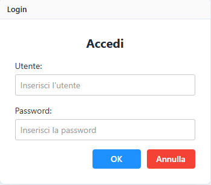
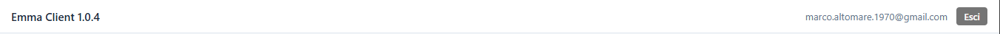
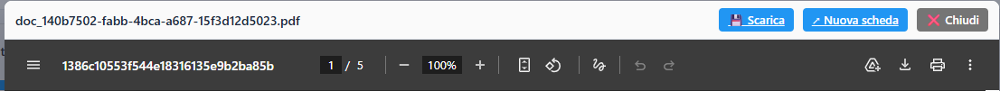
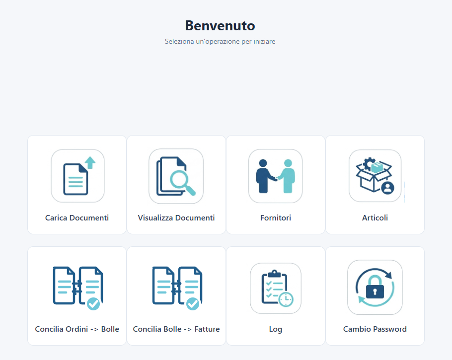
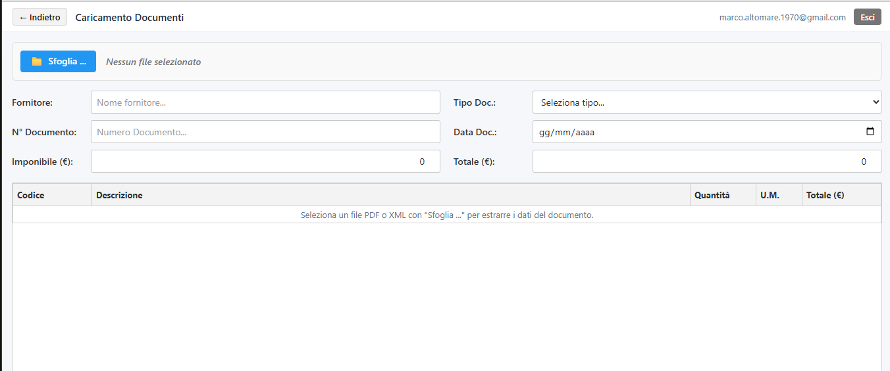
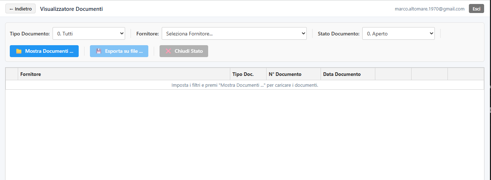
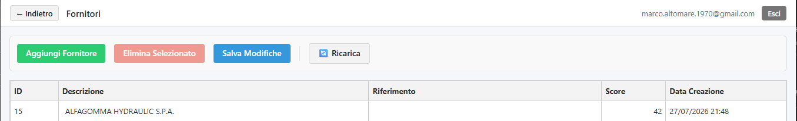
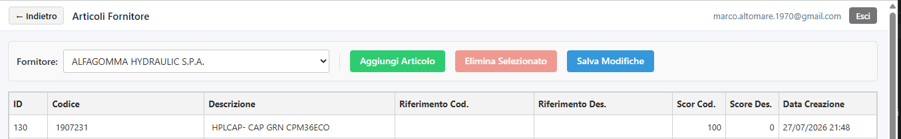
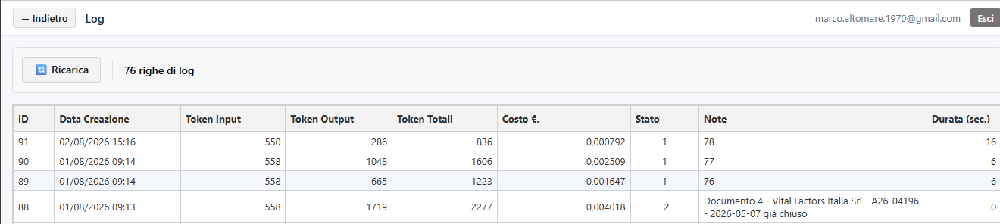
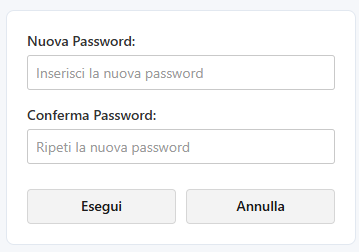

# Manuale Utente – EMMA Client Web

*Guida all'utilizzo della piattaforma documentale EMMA per l'utente aziendale.*

---

## Indice

1. [Introduzione](#1-introduzione)
2. [Accesso al sistema](#2-accesso-al-sistema)
3. [Elementi comuni a tutte le schermate](#3-elementi-comuni-a-tutte-le-schermate)
4. [Dashboard](#4-dashboard)
5. [Carica Documenti](#5-carica-documenti)
6. [Visualizza Documenti](#6-visualizza-documenti)
7. [Conciliazione dei documenti (3-Way Matching)](#7-conciliazione-dei-documenti-3-way-matching)
8. [Fornitori](#8-fornitori)
9. [Articoli Fornitore](#9-articoli-fornitore)
10. [Log](#10-log)
11. [Cambio Password](#11-cambio-password)
12. [Uscita dal sistema](#12-uscita-dal-sistema)

---

## 1. Introduzione

EMMA è la piattaforma documentale che acquisisce automaticamente ordini, bolle di consegna e fatture, ne estrae i dati tramite intelligenza artificiale e supporta l'azienda nella verifica e riconciliazione dei documenti (3-Way Matching).

Questo manuale descrive, schermata per schermata, tutte le funzionalità disponibili all'utente finale del Client Web.

### 1.1 Il flusso di lavoro tipico

Le schermate della piattaforma seguono l'ordine naturale delle attività quotidiane:

1. **Carica Documenti** – si carica il file (PDF o XML) di un ordine, di una bolla o di una fattura; il sistema ne estrae automaticamente testata e righe.
2. **Visualizza Documenti** – si controlla quanto è stato riconosciuto, si correggono eventuali errori e si chiudono i documenti lavorati.
3. **Fornitori** e **Articoli** – si mantiene allineata l'anagrafica, in modo che i documenti vengano associati al fornitore e all'articolo corretti del gestionale aziendale.
4. **Concilia Ordini → Bolle** e **Concilia Bolle → Fatture** – si confrontano i documenti tra loro per verificare che quanto ordinato sia stato consegnato e che quanto consegnato sia stato fatturato.
5. **Log** – si controlla l'esito delle elaborazioni automatiche.

---

## 2. Accesso al sistema

All'apertura del Client Web viene mostrata la finestra di accesso.

**Campi presenti:**

| Campo | Descrizione |
|---|---|
| Utente | Nome utente fornito in fase di attivazione del servizio |
| Password | Password associata all'utente |

**Pulsanti:**

- **OK** – conferma le credenziali inserite e avvia l'accesso. È possibile anche premere il tasto **Invio** dalla tastiera per ottenere lo stesso effetto. Durante la verifica delle credenziali il pulsante mostra una piccola animazione di caricamento e i campi risultano temporaneamente non modificabili.
- **Annulla** – svuota i campi Utente e Password inseriti.

**Messaggi che possono comparire:**

- *"Inserire Utente!"* – se si preme OK senza aver digitato il nome utente.
- *"Inserire Password!"* – se si preme OK senza aver digitato la password.
- *"Credenziali errate !"* – se utente o password non sono corretti; il campo password viene svuotato automaticamente per permettere un nuovo tentativo.

Se si è già autenticati (ad esempio perché si torna sulla pagina di login con una sessione ancora attiva), il sistema reindirizza automaticamente alla Dashboard senza richiedere nuovamente le credenziali.

Una volta effettuato correttamente l'accesso, si viene indirizzati alla **Dashboard**.

---

## 3. Elementi comuni a tutte le schermate

Alcuni elementi dell'interfaccia sono condivisi da più schermate e vengono descritti qui una sola volta.

### 3.1 Barra superiore

In ogni schermata successiva al login è presente una barra superiore che contiene:

- **Pulsante "← Indietro"** – presente in tutte le pagine tranne la Dashboard; riporta alla Dashboard.
- **Titolo della pagina corrente** (es. "Caricamento Documenti", "Visualizzatore Documenti", "Fornitori", "Articoli Fornitore", "Conciliazione Bolle / Fatture", "Log", "Cambio Password").
- **Pulsante "Manuale utente"** – l'icona a forma di libro aperto apre, in una finestra sovrapposta, questo stesso manuale in formato PDF. La finestra offre i pulsanti **💾 Scarica**, **↗ Nuova scheda** e **❌ Chiudi**.
- **Nome dell'utente collegato**, visualizzato sulla destra.
- **Pulsante "Esci"** – termina la sessione corrente e riporta alla schermata di Login (vedi [§12](#12-uscita-dal-sistema)).

### 3.2 Finestre di conferma e di messaggio

Molte operazioni (eliminazioni, salvataggi, cambi di stato) richiedono una conferma prima di essere eseguite. Compare una finestra con il messaggio dell'operazione e due pulsanti:

- **Sì** – conferma ed esegue l'operazione.
- **No** – annulla l'operazione.

> ⚠️ Nota: nella finestra di conferma il pulsante **Sì** è colorato di rosso e il pulsante **No** di verde. Si consiglia di leggere sempre il testo del pulsante prima di cliccare, senza affidarsi al colore.

Per messaggi informativi ("Informazione") o di errore ("Errore") compare invece una finestra con il solo pulsante **OK** per chiuderla. Facendo clic al di fuori della finestra la si chiude come se si fosse premuto **No** (per le conferme) o **OK** (per i messaggi).

### 3.3 Visualizzatore PDF

Quando si apre l'allegato PDF di un documento, viene mostrata una finestra con:

- L'anteprima del documento PDF, completa della barra strumenti del browser (zoom, numero di pagina, stampa).
- **💾 Scarica** – salva il file PDF sul proprio dispositivo.
- **↗ Nuova scheda** – apre il PDF in una nuova scheda del browser.
- **❌ Chiudi** – chiude l'anteprima.

### 3.4 Indicatore di elaborazione

Durante le operazioni che richiedono una chiamata al server (caricamento dati, salvataggi, conciliazione) la schermata viene temporaneamente disattivata: i pulsanti e i campi non rispondono ai clic fino al termine dell'operazione. È un comportamento normale: è sufficiente attendere.

### 3.5 Tipi e stati dei documenti

Le tendine "Tipo Documento" presenti in più schermate propongono sempre lo stesso elenco:

| Valore | Significato |
|---|---|
| 0. Tutti | Solo come filtro di ricerca: non è un tipo assegnabile a un documento |
| 1. Ordine | Ordine di acquisto emesso verso il fornitore |
| 2. DDT | Bolla / Documento Di Trasporto |
| 3. Fattura Accompagnatoria | Fattura che vale anche come documento di trasporto |
| 4. Fattura | Fattura di acquisto |
| 5. Nota di Accredito | Nota di credito (non gestita nelle funzioni di conciliazione) |

Ogni documento ha inoltre uno **stato**: *Aperto* (ancora da lavorare) oppure *Chiuso* (lavorazione conclusa). Le funzioni di conciliazione considerano esclusivamente i documenti in stato **Aperto**.

---

## 4. Dashboard

La Dashboard è la schermata principale che compare subito dopo l'accesso. Mostra una griglia di otto riquadri, ciascuno dei quali apre una delle funzionalità della piattaforma:

| Riquadro | Funzione |
|---|---|
| **Carica Documenti** | Apre la schermata di caricamento e riconoscimento automatico di un nuovo documento |
| **Visualizza Documenti** | Apre l'elenco dei documenti già acquisiti, con possibilità di verifica e riconciliazione |
| **Fornitori** | Apre l'anagrafica dei fornitori |
| **Articoli** | Apre l'anagrafica degli articoli associati a ciascun fornitore |
| **Concilia Ordini → Bolle** | Apre il confronto tra le righe degli ordini e le righe delle bolle di consegna |
| **Concilia Bolle → Fatture** | Apre il confronto tra le righe delle bolle di consegna e le righe delle fatture |
| **Log** | Apre lo storico delle elaborazioni effettuate dal sistema |
| **Cambio Password** | Apre la schermata per modificare la propria password |

È sufficiente fare clic su un riquadro per accedere alla relativa schermata.

---

## 5. Carica Documenti

Questa schermata permette di caricare un nuovo documento (PDF o XML) e di farne estrarre automaticamente i dati dal sistema.

### 5.1 Barra degli strumenti

- **📁 Sfoglia ...** – apre la finestra di selezione file del dispositivo. Sono accettati file **.pdf** e **.xml**, con dimensione massima di **50 MB**. Accanto al pulsante viene mostrato il nome del file selezionato e il suo stato:
  - *"Nessun file selezionato"* – nessun documento caricato.
  - *"Elaborazione in corso: [nome file]..."* – il documento è in fase di analisi da parte del sistema.
  - *[nome file]* – elaborazione completata.
- **➕ Aggiungi Riga** – disponibile dopo il caricamento di un documento; aggiunge una nuova riga alla griglia articoli, precompilata con valori segnaposto (*"NEW"*, *"Nuovo Articolo (fai clic per modificare)"*, U.M. *"PZ"*) da correggere manualmente.
- **🗑️ Elimina Riga** – disponibile dopo il caricamento di un documento e con una riga selezionata nella griglia; rimuove la riga selezionata.
- **✖ Pulisci** – disponibile dopo il caricamento di un documento; svuota tutti i campi e la griglia, riportando la schermata allo stato iniziale.
- **📄 Vedi PDF** – disponibile se al documento è associato un allegato PDF; apre l'anteprima del PDF (vedi [§3.3](#33-visualizzatore-pdf)). Il PDF viene inoltre mostrato automaticamente al termine del caricamento, se presente.

### 5.2 Campi della testata documento

| Campo | Descrizione |
|---|---|
| Fornitore | Nome del fornitore, riconosciuto automaticamente dal documento caricato |
| Tipo Doc. | Tipologia del documento, selezionabile da un elenco a tendina (vedi [§3.5](#35-tipi-e-stati-dei-documenti)) |
| N° Documento | Numero del documento |
| Data Doc. | Data del documento, nel formato gg/mm/aaaa |
| Imponibile (€) | Importo imponibile del documento |
| Totale (€) | Importo totale del documento |

Tutti i campi vengono compilati automaticamente dal riconoscimento AI dopo il caricamento del file, ma restano modificabili manualmente in caso di correzioni.

### 5.3 Griglia articoli

Sotto la testata è presente una tabella con le righe di dettaglio riconosciute nel documento:

| Colonna | Descrizione |
|---|---|
| Codice | Codice articolo |
| Descrizione | Descrizione dell'articolo |
| Quantità | Quantità indicata nel documento |
| U.M. | Unità di misura |
| Totale (€) | Importo totale della riga |

Ogni cella della griglia è modificabile direttamente facendo clic su di essa. Prima di caricare un file, la griglia mostra l'indicazione *"Seleziona un file PDF o XML con 'Sfoglia ...' per estrarre i dati del documento."*

> 💡 Il documento viene registrato nella piattaforma già al momento del caricamento del file: non esiste un pulsante "Salva" in questa schermata. Le correzioni ai dati riconosciuti si effettuano dalla schermata **Visualizza Documenti** ([§6](#6-visualizza-documenti)), dove ogni modifica viene salvata automaticamente.

---

## 6. Visualizza Documenti

Questa è la schermata principale per la consultazione e la verifica dei documenti già acquisiti dal sistema.

### 6.1 Filtri di ricerca

| Filtro | Descrizione |
|---|---|
| Tipo Documento | Elenco a tendina per filtrare per tipologia di documento; *0. Tutti* non applica alcun filtro |
| Fornitore | Elenco a tendina, popolato con i fornitori presenti in anagrafica; lasciandolo su *"Seleziona Fornitore..."* non si filtra per fornitore |
| Stato Documento | Elenco a tendina per filtrare per stato (*Aperto* / *Chiuso*) |

### 6.2 Barra degli strumenti

- **📁 Mostra Documenti ...** – applica i filtri impostati e carica l'elenco dei documenti corrispondenti.
- **💾 Esporta su file ...** – disponibile quando sono presenti documenti in elenco; genera e scarica un file **CSV** con i dati dei documenti e delle relative righe di dettaglio mostrati a video (vedi [§6.6](#66-formato-del-file-esportato)).
- **❌ Chiudi Stato** – disponibile quando sono presenti documenti in elenco; dopo conferma, cambia lo stato di **tutti** i documenti attualmente mostrati a video.

### 6.3 Elenco documenti (griglia principale)

| Colonna | Descrizione |
|---|---|
| (espansione) | Freccia per espandere/comprimere le righe di dettaglio del documento |
| Fornitore | Nome del fornitore |
| Tipo Doc. | Tipologia del documento, **modificabile** tramite elenco a tendina |
| N° Documento | Numero del documento |
| Data Documento | Data del documento |

Facendo clic su una riga (o sulla freccia) si espande/comprime il dettaglio del documento; è espanso un solo documento alla volta.

La colonna **Tipo Doc.** è modificabile: se il riconoscimento automatico ha classificato male un documento (ad esempio una bolla riconosciuta come fattura) è possibile correggerlo selezionando il tipo corretto dalla tendina. La modifica richiede una conferma. L'elenco a tendina non propone la voce *0. Tutti*, che è solo un criterio di ricerca.

Sulla destra di ogni riga sono presenti tre pulsanti:

- **Pulsante di cambio stato** (etichetta variabile: *Apri* / *Chiudi* a seconda dello stato corrente) – dopo conferma, cambia lo stato del singolo documento.
- **Elimina** – dopo conferma, elimina definitivamente il documento.
- **PDF** – disponibile solo se al documento è associato un allegato; apre l'anteprima del PDF (vedi [§3.3](#33-visualizzatore-pdf)).

### 6.4 Dettaglio del documento (righe)

Espandendo un documento viene mostrata la tabella delle righe che lo compongono:

| Colonna | Descrizione |
|---|---|
| Codice | Codice articolo, modificabile |
| Descrizione | Descrizione articolo, modificabile |
| U.M. | Unità di misura, modificabile |
| Q.tà | Quantità, modificabile |
| Imponibile | Importo imponibile della riga, modificabile |
| IVA | Aliquota IVA (sola visualizzazione) |
| Totale | Importo totale della riga, modificabile |
| (conciliazione) | Pulsante **Conciliazione**, attivo solo se la riga è già stata conciliata (vedi [§6.5](#65-dettaglio-della-conciliazione-di-una-riga)) |
| (azione) | Pulsante **Aggiungi** (verde) per le righe appena create non ancora salvate, oppure **Elimina** (rosso) per le righe già registrate |

Ogni modifica a una cella di una riga già registrata viene inviata automaticamente al sistema non appena si esce dal campo. Per le righe nuove, aggiunte con il pulsante **+ Nuova Riga** in fondo alla tabella di dettaglio, è necessario premere il pulsante **Aggiungi** sulla riga stessa per registrarla; il pulsante **Elimina**, dopo conferma, rimuove invece una riga già registrata.

Se il documento non ha righe di dettaglio, viene mostrato il messaggio *"Nessuna riga di dettaglio."*.

### 6.5 Dettaglio della conciliazione di una riga

Il pulsante **Conciliazione**, presente su ogni riga di dettaglio, apre una finestra che mostra come quella riga è stata abbinata ai documenti collegati. Il titolo della finestra riporta *numero documento / codice articolo – descrizione articolo*.

| Colonna | Descrizione |
|---|---|
| Q.tà | Quantità presente sulla riga del documento |
| Q.tà Conciliata | Quantità effettivamente abbinata al documento collegato |
| Delta | Differenza tra le due quantità: un valore diverso da zero segnala una discrepanza da verificare |
| Flag | Casella di spunta (sola lettura): selezionata quando la riga risulta conciliata |
| Num.Doc.Abb. | Numero del documento con cui la riga è stata abbinata |
| Data.Doc.Abb. | Data del documento di abbinamento |

Il pulsante **❌ Chiudi** chiude la finestra. Se per la riga non esistono abbinamenti, compare il messaggio *"Nessun dato di conciliazione per questa riga."*.

### 6.6 Formato del file esportato

Il pulsante **💾 Esporta su file ...** produce un file CSV con separatore **punto e virgola (`;`)**, strutturato su due tipi di record:

- Righe che iniziano con **`M`** (*master*): dati di testata del documento – identificativo, fornitore, numero documento, data, tipo documento, stato e codice del fornitore nel gestionale aziendale.
- Righe che iniziano con **`R`** (*riga*): dati della singola riga articolo – identificativo, codice, descrizione, quantità, unità di misura, codice e descrizione di riferimento dell'articolo nel gestionale aziendale.

Ogni record `M` è seguito dai propri record `R`. Il file viene scaricato dal browser con un nome generato automaticamente.

---

## 7. Conciliazione dei documenti (3-Way Matching)

La piattaforma mette a disposizione due schermate di conciliazione, raggiungibili dai riquadri **Concilia Ordini → Bolle** e **Concilia Bolle → Fatture** della Dashboard. Le due schermate funzionano esattamente allo stesso modo e cambiano solo per i documenti che confrontano:

| Schermata | Griglia di sinistra | Griglia di destra |
|---|---|---|
| **Concilia Ordini → Bolle** | Ordini | Bolle / DDT |
| **Concilia Bolle → Fatture** | Bolle / DDT | Fatture e Fatture Accompagnatorie |

L'obiettivo è verificare che le quantità presenti sui documenti "a valle" trovino corrispondenza nei documenti "a monte": che ciò che è stato consegnato corrisponda a ciò che era stato ordinato, e che ciò che è stato fatturato corrisponda a ciò che è stato consegnato.

> ℹ️ Vengono presi in considerazione **solo i documenti in stato Aperto**. Un documento già chiuso dalla schermata Visualizza Documenti non compare in queste griglie.

### 7.1 Barra degli strumenti

- **Fornitore** – elenco a tendina per limitare l'analisi a un singolo fornitore. Lasciando *"Seleziona Fornitore..."* vengono caricati i documenti di tutti i fornitori.
- **Da Data** / **A Data** – intervallo di date sul quale filtrare i documenti. All'apertura della schermata sono proposti l'ultimo mese (da un mese fa a oggi). Se la data iniziale è successiva alla data finale compare il messaggio *"La data iniziale non può essere successiva alla data finale."*.
- **🔄 Carica Dati** – applica i filtri e popola entrambe le griglie.
- **🔗 Concilia** – avvia l'analisi automatica di abbinamento (vedi [§7.4](#74-eseguire-la-conciliazione)).
- **💾 Salva** – registra nella piattaforma le conciliazioni proposte e le eventuali correzioni manuali.

### 7.2 Struttura delle due griglie

Le due griglie sono affiancate e hanno la stessa struttura. I dati sono organizzati su **tre livelli**:

1. **Fornitore** – riga di raggruppamento che riporta il nome del fornitore e il conteggio *"N documenti · N righe · N selezionate"*.
2. **Documento** – all'interno di ciascun fornitore, un livello per numero e data documento, con il conteggio *"N righe · N selezionate"*.
3. **Riga articolo** – il dettaglio vero e proprio.

Facendo clic sulla riga di un gruppo (o sulla freccia ► / ▼) lo si espande o richiude. Se il caricamento restituisce un solo fornitore, quel fornitore risulta già espanso.

Le colonne visualizzate sono:

| Colonna | Descrizione |
|---|---|
| (casella di spunta) | Selezione della riga; le caselle sui livelli fornitore e documento selezionano o deselezionano l'intero gruppo, quella nell'intestazione l'intera griglia |
| Fornitore | Nome del fornitore (livello di raggruppamento) |
| Numero Documento | Numero del documento (livello di raggruppamento) |
| Data Documento | Data del documento |
| Codice Articolo | Codice articolo della riga |
| Descrizione Articolo | Descrizione articolo della riga |
| Quantità | Quantità presente sulla riga |
| Qtà Conc. | Quantità già conciliata per quella riga |
| Stato | *(solo griglia di destra)* Esito dell'abbinamento proposto dal sistema |
| Note | *(solo griglia di destra)* Annotazione, generata dal sistema e modificabile manualmente |

In alto a ciascuna griglia sono presenti:

- **Espandi tutto / Comprimi tutto** – apre o chiude in un colpo solo tutti i fornitori e tutti i documenti della griglia.
- Un contatore *"N / N selezionate"* che riepiloga le righe spuntate rispetto al totale.

Finché non si preme **Carica Dati**, ciascuna griglia mostra l'indicazione *"Imposta i filtri e premi 'Carica Dati' per caricare le bolle."* (o *"... le fatture."*).

### 7.3 Il significato dello stato

La colonna **Stato**, valorizzata dopo l'elaborazione, indica l'esito dell'abbinamento della riga:

| Stato | Significato |
|---|---|
| *(vuoto)* | Riga non ancora sottoposta ad analisi |
| Riga conciliata | Le quantità corrispondono: la riga viene spuntata automaticamente |
| Riga conciliata con differenza di quantità | È stato trovato un abbinamento, ma le quantità non coincidono; la colonna **Note** riporta il dettaglio della differenza e la riga resta da verificare manualmente |
| NON_CONCILIATA | Per la riga non è stato trovato alcun abbinamento nei documenti dell'altra griglia |

### 7.4 Eseguire la conciliazione

1. Impostare i filtri (fornitore e intervallo di date) e premere **🔄 Carica Dati**: le due griglie si popolano con i documenti aperti che rispettano i criteri.
2. Premere **🔗 Concilia**. Il sistema chiede conferma indicando quante righe verranno confrontate (*"Conciliare N righe bolla con N righe fattura?"*).
3. L'analisi combina un confronto esatto sui codici articolo con un confronto "fuzzy" sulle descrizioni, in grado di riconoscere corrispondenze anche quando i codici del fornitore e quelli aziendali non coincidono.
4. Al termine compare un riepilogo per ciascun fornitore con: numero di righe della griglia di sinistra non conciliate, numero di righe della griglia di destra non conciliate e numero di conciliazioni proposte.
5. Le griglie si aggiornano: le righe abbinate senza differenze di quantità risultano spuntate, viene valorizzata la colonna **Qtà Conc.** e vengono compilate le colonne **Stato** e **Note**.
6. Verificare le righe segnalate con differenze o non conciliate. Le caselle di spunta e il campo **Note** restano modificabili manualmente.
7. Premere **💾 Salva** per registrare le conciliazioni. Al termine compare il messaggio *"Salvataggio conciliazioni terminato."*.

> ⚠️ Le proposte di conciliazione non vengono registrate automaticamente: senza premere **💾 Salva**, uscendo dalla schermata il lavoro svolto viene perso.

Se si preme **💾 Salva** con una delle due griglie vuota, compare il messaggio *"Caricare prima i dati per poter proporre la conciliazione."*.

L'esito della conciliazione è poi consultabile, documento per documento, dal pulsante **Conciliazione** presente sulle righe di dettaglio della schermata Visualizza Documenti (vedi [§6.5](#65-dettaglio-della-conciliazione-di-una-riga)).

---

## 8. Fornitori

Questa schermata gestisce l'anagrafica dei fornitori.

### 8.1 Barra degli strumenti

- **Aggiungi Fornitore** – aggiunge una nuova riga vuota in fondo alla tabella, da compilare.
- **Elimina Selezionato** – disponibile con un fornitore selezionato in tabella; dopo conferma, elimina il fornitore (se già registrato) o rimuove semplicemente la riga (se non ancora salvata).
- **Salva Modifiche** – dopo conferma, salva tutte le righe nuove o modificate; al termine viene mostrato il messaggio *"Salvataggio completato: N inseriti, N aggiornati."*.
- **🔄 Ricarica** – ricarica l'elenco dei fornitori dal sistema. Se sono presenti modifiche non ancora salvate, viene chiesta conferma con il messaggio *"Ci sono modifiche non salvate. Ricaricare comunque?"* per evitare di perderle.

Quando sono presenti modifiche non salvate, accanto ai pulsanti compare l'indicazione *"[N] modifica/e non salvate"*.

### 8.2 Tabella fornitori

| Colonna | Descrizione |
|---|---|
| Descrizione | Nome/ragione sociale del fornitore, modificabile |
| Riferimento | Codice di riferimento del fornitore nel sistema gestionale aziendale, modificabile |
| Score | Punteggio di corrispondenza assegnato dal sistema (sola visualizzazione) |
| Data Creazione | Data e ora di creazione del fornitore in anagrafica |

Facendo clic su una riga la si seleziona (necessario per il pulsante **Elimina Selezionato**). Le righe non ancora salvate e quelle modificate ma non salvate vengono evidenziate graficamente rispetto alle righe invariate. Se l'anagrafica è vuota compare il messaggio *"Nessun fornitore presente."*.

> 💡 Il campo **Riferimento** è quello che collega il fornitore riconosciuto da EMMA al fornitore del gestionale aziendale: viene riportato nel file CSV esportato dalla schermata Visualizza Documenti.

---

## 9. Articoli Fornitore

Questa schermata gestisce l'anagrafica degli articoli, organizzata per fornitore.

### 9.1 Barra degli strumenti

- **Fornitore** – elenco a tendina per selezionare il fornitore di cui visualizzare gli articoli. È necessario selezionare un fornitore prima di poter usare le altre funzioni della pagina.
- **Aggiungi Articolo** – disponibile con un fornitore selezionato; aggiunge una nuova riga vuota in fondo alla tabella.
- **Elimina Selezionato** – disponibile con un articolo selezionato in tabella; dopo conferma, elimina l'articolo (se già registrato) o rimuove semplicemente la riga (se non ancora salvata).
- **Salva Modifiche** – disponibile con un fornitore selezionato; dopo conferma, salva tutte le righe nuove o modificate; al termine viene mostrato il messaggio *"Salvataggio completato: N inseriti, N aggiornati."*.

Quando sono presenti modifiche non salvate, accanto ai pulsanti compare l'indicazione *"[N] modifica/e non salvate"*.

### 9.2 Tabella articoli

| Colonna | Descrizione |
|---|---|
| Codice | Codice dell'articolo, modificabile |
| Descrizione | Descrizione dell'articolo, modificabile |
| Riferimento Cod. | Codice di riferimento nel sistema gestionale aziendale, modificabile |
| Riferimento Des. | Descrizione di riferimento nel sistema gestionale aziendale, modificabile |
| Scor Cod. | Punteggio di corrispondenza sul codice (sola visualizzazione) |
| Score Des. | Punteggio di corrispondenza sulla descrizione (sola visualizzazione) |
| Data Creazione | Data e ora di creazione dell'articolo in anagrafica |

Come nella schermata Fornitori, le righe nuove o modificate vengono evidenziate graficamente. Se non è stato selezionato alcun fornitore, la tabella mostra il messaggio *"Seleziona un fornitore per vedere gli articoli."*; se il fornitore non ha articoli associati, viene mostrato *"Nessun articolo per questo fornitore."*.

> 💡 Un'anagrafica articoli curata migliora sensibilmente la qualità della conciliazione automatica ([§7](#7-conciliazione-dei-documenti-3-way-matching)): i campi **Riferimento Cod.** e **Riferimento Des.** permettono al sistema di riconoscere lo stesso articolo anche quando fornitori diversi lo indicano con codici diversi.

---

## 10. Log

Questa schermata mostra lo storico delle elaborazioni AI effettuate dal sistema, utile per monitorare l'attività e individuare i documenti che non sono stati elaborati correttamente.

### 10.1 Barra degli strumenti

- **🔄 Ricarica** – rilegge dal sistema l'elenco completo dei log.
- **Da** / **A** – intervallo di date su cui filtrare le righe. Il filtro è inclusivo su entrambi gli estremi e viene applicato immediatamente sulle righe già caricate, senza rileggere i dati dal server.
- **Stato** – elenco a tendina per filtrare per esito dell'elaborazione (vedi tabella al [§10.2](#102-tabella-log)). All'apertura della schermata il filtro è impostato su *1 – OK*.
- **Mese corrente** – imposta automaticamente Da/A sul primo e sull'ultimo giorno del mese in corso.
- **Mese precedente** – imposta automaticamente Da/A sul mese precedente.
- **Reimposta filtri** – azzera l'intervallo di date e riporta il filtro Stato al valore iniziale *1 – OK*.

A destra dei pulsanti viene mostrato il conteggio delle righe: *"N righe di log"* quando non è attivo alcun filtro, oppure *"N righe su N"* quando un filtro è attivo.

### 10.2 Tabella log

| Colonna | Descrizione |
|---|---|
| Data Creazione | Data e ora dell'elaborazione (formato gg/mm/aaaa hh:mm) |
| Stato | Esito dell'elaborazione |
| Note | Messaggio prodotto dal sistema: identifica il documento elaborato e, in caso di problemi, ne descrive la causa |
| Durata (sec.) | Tempo impiegato dall'elaborazione, in secondi |

I valori possibili della colonna **Stato** sono:

| Valore | Significato |
|---|---|
| 1 – OK | Elaborazione completata correttamente |
| 0 – Non definito | Esito non determinato |
| -1 – Errore AI | Il motore di riconoscimento non è riuscito a interpretare il documento |
| -2 – Errore server | Errore della piattaforma durante l'elaborazione (ad esempio un documento già chiuso) |

Le righe sono ordinate dalla più recente alla più vecchia. Questa tabella è di sola consultazione: non è possibile modificarne i dati. Se non sono presenti log compare il messaggio *"Nessun log disponibile."*; se il filtro impostato non seleziona alcuna riga compare *"Nessun log nel periodo selezionato."*.

---

## 11. Cambio Password

Questa schermata permette di modificare la propria password di accesso.

**Campi:**

| Campo | Descrizione |
|---|---|
| Nuova Password | La nuova password da impostare |
| Conferma Password | Ripetizione della nuova password, per verifica |

**Pulsanti:**

- **Esegui** – convalida e applica il cambio password.
- **Annulla** – riporta alla Dashboard senza applicare alcuna modifica.

**Regole della password:** la nuova password deve essere lunga **almeno 8 caratteri** e contenere **almeno una lettera maiuscola, una lettera minuscola, un numero e un carattere speciale** (uno tra `@ $ ! % * ? &`).

**Messaggi che possono comparire:**

- *"Inserire Password !"* – se il campo Nuova Password è vuoto.
- *"Password non coincidenti !"* – se i due campi non corrispondono.
- *"La password deve essere lunga almeno 8 caratteri, contenere almeno una lettera maiuscola, un numero e un carattere speciale."* – se la password non rispetta i requisiti minimi.
- *"Password cambiata con successo !"* – al termine dell'operazione, prima di essere riportati alla Dashboard.
- *"Cambio password non riuscito."* – in caso di errore imprevisto durante il salvataggio.

Dal successivo accesso sarà necessario utilizzare la nuova password.

---

## 12. Uscita dal sistema

Per terminare la sessione di lavoro è sufficiente premere il pulsante **Esci** presente nella barra superiore (vedi [§3.1](#31-barra-superiore)). L'utente viene disconnesso e riportato alla schermata di Login.

> ⚠️ Prima di uscire, assicurarsi di aver salvato le modifiche in sospeso nelle schermate Fornitori, Articoli e Conciliazione: l'uscita non chiede conferma e le modifiche non salvate vengono perse.

---
